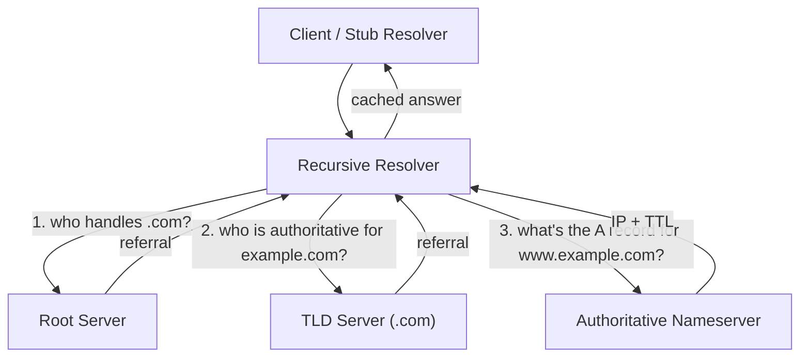
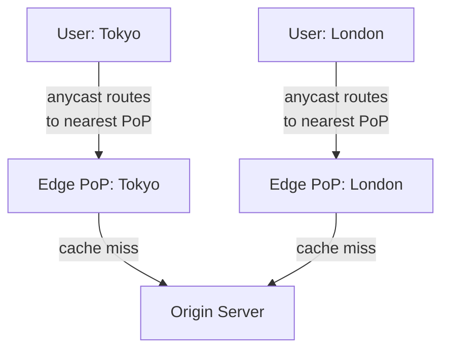
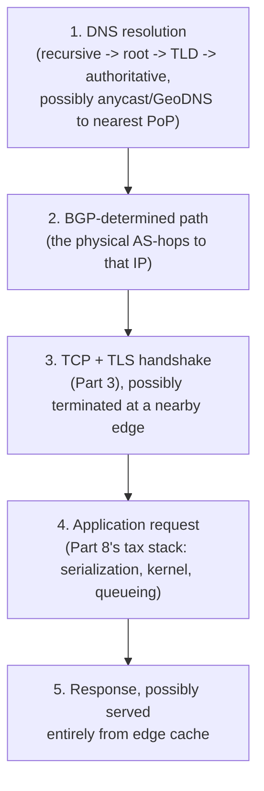

# Prerequisite Concepts, Part 9: The Anatomy of a Request (DNS, BGP, and the Edge)

[Part 8](08_cost_of_communication.md) modeled a remote call as a stack of taxes — DNS,
TCP, TLS, kernel, serialization — but treated "DNS resolution" as a single line in a table
and started the physics discussion only once a packet already knew where it was going.
This part goes one layer earlier: **before any of Part 8's taxes can be paid, the client
has to answer two questions — what IP address am I even talking to, and what physical path
does a packet take to get there — and both answers are resolved by systems most engineers
never look at until they break.** [Part 3](03_communication_and_resilience.md) already
gave you the one-sentence version of DNS; this part unpacks the hierarchy underneath it,
introduces BGP (the protocol that makes "the internet" a coherent thing at all instead of
a pile of disconnected networks), and shows how CDNs use both together to make Part 6's
"shorten the distance" argument concrete at global scale.

## Recap: What Part 3 Already Owns, and What This Part Adds

Part 3's version: "the browser asks a DNS resolver, which finds the IP." True, and enough
for most interviews. What it deliberately left out — and what a staff-level "walk me
through what happens when you hit enter" answer is actually expected to go on to say:

| Question | Part 3's answer | This part's answer |
|---|---|---|
| Who does the resolver actually ask? | "A hierarchy of nameservers" | The exact hierarchy: root → TLD → authoritative, and why each layer exists |
| Why does a stale DNS entry linger after a fix? | Not covered | TTL is a *hint*, not a guarantee — caching resolvers can ignore it |
| How does a packet find the server once you have an IP? | Not covered | BGP — the routing protocol that stitches independently-owned networks into one internet |
| How does a CDN answer requests from wherever you are? | Not covered | Anycast + GeoDNS, and edge PoPs that terminate TLS close to the user |

## DNS, Fully Unpacked: The Hierarchy Behind One Bullet Point

DNS is a **distributed, hierarchical database** — no single server holds the whole
internet's name-to-IP mapping, because a single server that every lookup on Earth hit would
be both a latency disaster (everyone round-tripping to one place) and a single point of
failure, exactly the failure mode [Part 3's resilience
vocabulary](03_communication_and_resilience.md#resilience-vocabulary) warns against
generically. The hierarchy exists specifically to distribute both the *load* and the
*authority* for answering "what's the IP for this name":

1. **Recursive resolver** — the server your client actually talks to (your ISP's, or a
   public one like Google's `8.8.8.8` or Cloudflare's `1.1.1.1`). It does the walking on
   the client's behalf and **caches the result**, so most real-world lookups never touch
   steps 2-4 at all — this cache is why DNS "usually" feels instant.
2. **Root servers** — don't know the IP for `example.com`; they know which TLD server
   handles `.com` and hand back a referral, nothing more. There are 13 logical root server
   *addresses*, but each is served by hundreds of physical machines worldwide via
   **anycast** (covered below) — the same "one IP, many physical locations" trick a CDN
   uses, deployed here specifically so a foundational, globally-depended-on service isn't
   a single physical point of failure or a single distant round trip for every resolver on
   Earth.
3. **TLD servers** — `.com`, `.org`, `.io`, each typically run by a registry operator
   (e.g., Verisign for `.com`). They don't know `example.com`'s IP either; they know which
   **authoritative nameserver** is responsible for that specific domain and refer the
   resolver there.
4. **Authoritative nameserver** — the domain owner's own DNS (self-hosted, or a managed
   provider like Route 53 or Cloudflare DNS). This is the only layer that actually holds
   the real answer — the A/AAAA record — and it ships a **TTL** alongside it.

**Why the referral chain matters beyond trivia**: each of those four hops is, mechanically,
exactly the "remote call" [Part 8](08_cost_of_communication.md) describes — DNS mostly
rides on **UDP port 53** specifically because [Part 3's TCP-vs-UDP
trade-off](03_communication_and_resilience.md#tcp-vs-udp) favors it here: a lookup is a
single small request/response, and retrying a lost UDP query is cheaper than paying a full
TCP handshake for every name lookup on the internet (DNS falls back to TCP only for
responses too large for one UDP packet, or zone transfers).

### TTL: A Hint, Not a Promise — and Why That Breaks Failover

The authoritative nameserver's answer ships with a **Time To Live (TTL)** — "cache this for
N seconds." The TTL is the domain owner's *request* for how long to be trusted, not an
enforceable contract: a corporate proxy, an ISP resolver, or a misconfigured client can
(and in practice sometimes does) cache an answer well past its stated TTL. This single fact
is the direct mechanical reason behind a failure mode that shows up repeatedly elsewhere in
this repo — a **DNS-based failover** that a runbook promises will complete in "TTL seconds"
can instead take much longer, because some fraction of clients are holding a cached IP the
authoritative server has no way to actively revoke. This is precisely the gap the
[DR-failover-took-8x-longer
scenario](../12_tricky_scenarios/12_dr_failover_slow.md#likely-root-causes-ranked) points
at when it flags "DNS/traffic-manager propagation delay," and exactly why
[Part 10's global traffic manager](../10_cost_security_multiregion/tutorial.md) is
described as **health-check-based failover**, not TTL-based — a health-check-driven system
can redirect traffic at the load-balancer layer without waiting on every cache on Earth to
expire naturally.

**The practical trade-off this creates for anyone operating DNS**: a short TTL (seconds to
low minutes) gives faster failover and faster propagation of legitimate changes, at the
cost of every resolver on Earth re-querying your authoritative server far more often; a
long TTL (hours) is cheap on query volume but means a bad record, once cached, lingers.
Neither number is "correct" in the abstract — it's a direct trade of **operational agility
against query load**, tuned per record based on how likely that specific record is to need
to change in an emergency.

### The Record Types Worth Knowing by Name

| Record | Answers | Example use |
|---|---|---|
| **A** | Name → IPv4 address | `example.com → 93.184.216.34` |
| **AAAA** | Name → IPv6 address | The IPv6 equivalent of an A record |
| **CNAME** | Name → another name (alias) | `www.example.com → example.com` |
| **NS** | Which nameservers are authoritative for this zone | The referral mechanism itself |
| **MX** | Which mail servers accept email for this domain | Routing inbound email, not web traffic |
| **TXT** | Arbitrary text | Domain-ownership verification, SPF/DKIM anti-spam records |

## BGP: The Protocol That Makes "The Internet" One Thing

Having an IP address answers *what* to talk to; it says nothing about *how a packet
physically gets there*. The internet is not one network — it's tens of thousands of
independently-owned networks (an ISP, a cloud provider, a university, a corporation), each
called an **Autonomous System (AS)**, identified by a globally unique number (an **ASN** —
e.g., a large cloud provider might operate as AS15169). **Border Gateway Protocol (BGP)**
is the protocol ASes use to tell each other what they can reach, and it is, without
exaggeration, the reason a request from a phone in Mumbai can reach a server in Virginia at
all — nothing about IP addressing alone guarantees a path exists between any two of them.

**The mechanism**: each AS **advertises** the IP prefixes it owns (or can reach) to its
directly-connected neighbor ASes, tagged with the **AS-path** — the ordered list of ASes a
packet would cross to get there. A neighbor receiving that advertisement can re-advertise
it onward to *its* neighbors, appending itself to the path — reachability information
propagates hop-by-hop across the entire AS graph this way, with no single party holding a
complete map of the whole internet at once. This makes BGP a **path-vector protocol**,
distinct from the shortest-path/link-state protocols (like OSPF) used for routing *inside*
a single AS — BGP's job is coordination *between* independently-administered networks, a
fundamentally different, much less trusting problem than routing within one.

**Why "shortest path" is the wrong mental model**: when a router has multiple advertised
routes to the same prefix, it picks one using a **policy**, not physics — AS-path length is
one input, but business relationships (a paid transit agreement vs. a settlement-free
peering arrangement) routinely override pure hop-count. A packet's route is decided by
**economics and contracts layered on top of the physical network**, not by "the shortest
cable" — the [physical, speed-of-light floor Part 6
derives](06_mechanical_sympathy_and_physics_of_latency.md#distance-of-data-one-physical-idea-two-different-scales)
still bounds every individual link, but which sequence of links your packet actually
traverses is a *human, contractual* decision layered on top of that physics, and can
absolutely be longer than the shortest physically possible path.

### BGP Hijacks and Leaks: When the Trust Model Breaks

BGP was designed assuming every AS honestly advertises only prefixes it legitimately owns —
there's no built-in cryptographic proof of that claim in the base protocol. When an AS
advertises a prefix it doesn't actually own — by misconfiguration (a **route leak**) or
deliberately (a **hijack**) — its neighbors have historically had no automatic way to
reject it, and that bad advertisement can propagate globally in minutes, silently pulling
traffic destined for the real owner toward the misconfigured or malicious AS instead. This
isn't hypothetical: in one of the most-cited real-world cases, a national ISP tried to
block a video-sharing site *on its own internal network* by null-routing its IP block, then
leaked that same route to an upstream provider — the leak propagated through BGP across the
global internet, and traffic bound for the video site was mis-routed worldwide for roughly
two hours, until the leak was traced and withdrawn. **The modern mitigation is RPKI
(Resource Public Key Infrastructure)** — a cryptographic system letting a prefix owner sign
a **Route Origin Authorization** stating which ASes are legitimately allowed to originate
that prefix, so a receiving router can validate an advertisement instead of trusting it
blindly.

**Why convergence time matters for everything else in this repo**: a BGP change doesn't
take effect everywhere simultaneously — it propagates hop-by-hop, and full internet-wide
convergence after a significant route change is measured in **tens of seconds to several
minutes**, not milliseconds. This is a second, independent reason (alongside DNS TTL
above) that DR/failover runbooks measured in "minutes" are describing a real, physical
floor of the routing system itself — not a conservative padding number someone made up —
directly relevant to any multi-region failover design, including the RTO discussion in
[Part 10](../10_cost_security_multiregion/tutorial.md).

## Anycast: One IP Address, Many Physical Locations

**The problem anycast solves**: a single physical server answering one IP address is both
a latency problem (every client on Earth pays the same physical distance to reach it,
however far that happens to be) and a resilience problem (that one server or datacenter is
a SPOF). **Anycast's answer**: announce the *same* IP address via BGP from many physically
separate locations simultaneously. Routers along the path don't know or care that the
prefix is multiply-announced — ordinary BGP path selection naturally routes each client's
packets to whichever announcing location is "closest" by the routing system's own metric
(AS-path length and policy, not literal geographic distance), and if one location
disappears, its BGP advertisement is simply withdrawn and traffic re-routes to the next
nearest one, with no explicit failover logic required at all.

This is exactly the mechanism root DNS servers use (the "13 root servers" are actually
hundreds of physical machines sharing those 13 IPs via anycast), and it's the same
mechanism most modern CDNs and DDoS-mitigation providers rely on: a large-scale volumetric
attack aimed at one anycast IP is naturally **absorbed and diluted across every location
simultaneously announcing it**, rather than concentrated on a single target.

**How this connects back to Part 6's core argument**: anycast is a *routing-layer* trick
for doing exactly what [Part 6](06_mechanical_sympathy_and_physics_of_latency.md) argues is
the only real lever on latency — **shortening the physical distance a signal has to
travel** — except the "shortening" happens automatically, at the BGP layer, instead of
being something an application explicitly chooses (like picking a nearby cache).

## The Edge: Where DNS, Anycast, and BGP Meet a CDN

A **CDN (Content Delivery Network)** is the productized combination of everything above,
built to answer one question: **how do I serve a request from the location physically
closest to whoever's asking, automatically, at global scale?**

- **PoPs (Points of Presence)** — physical facilities a CDN operates close to end users,
  often directly peered with local ISPs to minimize the number of AS-hops (and therefore
  BGP-negotiated distance) a request has to cross before hitting CDN infrastructure at all.
- **Getting the client to the *right* PoP** happens one of two ways: **anycast** (every
  PoP announces the same IP; BGP naturally routes each client to the topologically nearest
  one — Cloudflare's model) or **GeoDNS** (the authoritative nameserver itself returns a
  *different* IP depending on the resolver's apparent geographic/network location —
  functionally similar in outcome, decided at the DNS layer instead of the routing layer).
- **Cache hit vs. cache miss** — a hit is served entirely from the PoP, paying none of
  Part 8's cross-region taxes at all; a miss has to reach back to origin, which is exactly
  the [cache-population strategy the video-streaming case study's CDN
  deep-dive](http://127.0.0.1:8002/08_design_video_streaming/tutorial/#deep-dive-cdn-architecture-and-cache-invalidation)
  covers — including **origin shield**, an intermediate layer that deduplicates concurrent
  misses across many edge nodes so a sudden spike in popularity doesn't send a thundering
  herd of identical requests at the origin simultaneously.
- **TLS termination at the edge** — the PoP, being physically close to the user, completes
  the [TLS handshake Part 3 and Part 8
  describe](03_communication_and_resilience.md#what-actually-happens-when-you-hit-enter)
  locally, instead of that handshake round-tripping all the way to a distant origin. This
  is a direct, separate application of "shorten the distance" specifically to *connection
  setup* — independent of whether the requested content is even cacheable, since even a
  cache-miss request still benefits from a nearby TLS handshake before the PoP forwards the
  (now-decrypted-once, re-encrypted) request onward to origin.
- **Edge compute** (Lambda@Edge, Cloudflare Workers, Fastly Compute) — the next step past
  caching *bytes* at the edge: running actual application logic at the PoP itself
  (authentication checks, A/B routing, request rewriting) so even *dynamic* logic pays the
  short, local round trip instead of a long one to origin.

### Worked Example: A Static Asset, With and Without a CDN

Reusing [Part 8's SF↔London worked
example](08_cost_of_communication.md#physics-sets-the-floor-a-worked-rpc-example) — a user
in London requesting a static asset from an origin server in San Francisco, versus the same
request served from a CDN PoP in London itself (illustrative and approximate figures; the
relationship, not the exact numbers, is the point):

| Path | Round trips paid at ~85 ms/RTT (SF↔London floor) | Approx. total |
|---|---|---|
| Direct to SF origin (TCP + TLS + HTTP) | 3 RTTs | ≈255 ms + origin processing |
| CDN PoP in London (cache hit) | TCP + TLS handshake to a PoP a few ms away | **~5-10 ms** total |

The CDN doesn't just avoid re-fetching from origin — it collapses the physical round trip
that Part 6 and Part 8 both identify as the dominant cost from ~85 ms-per-hop down to
effectively local-network numbers, for every single request that hits cache, without the
application changing a single line of code.

## Putting the Full Anatomy Together

Combining this doc with Parts 3, 6, and 8 into the complete sequence a "hit enter" answer
is actually expected to walk through at a staff bar:

Steps 1-2 are this doc's contribution: *finding* the IP and the physical path to it. Step 3
is [Part 3](03_communication_and_resilience.md)'s territory. Step 4 is [Part
8](08_cost_of_communication.md)'s stack of taxes. A senior answer to "what happens when you
hit enter" usually starts at step 3; a staff-level answer names steps 1-2 explicitly,
because that's frequently where a real "why is this slow" or "why did failover take so
long" investigation actually needs to look.

## Designing and Operating From First Principles

1. Do I need to run my own authoritative DNS, or does a managed provider's anycast network
   already solve the "one IP, globally close, resilient" problem better than I could?
2. Is each record's TTL deliberately tuned — short for anything that might need emergency
   failover, longer for anything stable — rather than left at a default?
3. Does my failover mechanism actually depend on DNS TTL expiring, or does it use
   health-check-based traffic management that doesn't wait on every client's cache?
4. Am I using anycast or a CDN to shorten physical distance for global users, not relying
   on caching (Part 8) alone?
5. Do I terminate TLS at the edge for geographically distant clients, or is every one of
   them paying a full cross-region handshake?
6. Have I planned for a cache-miss stampede at origin (an origin shield), not just assumed
   the CDN "handles it"?
7. Do I monitor and protect my own advertised prefixes against BGP route leaks/hijacks
   (RPKI), given how little of that trust model is enforced by default?
8. Does my DR/multi-region runbook's RTO account for BGP convergence and DNS-propagation
   floors measured in minutes, or does it assume failover is instantaneous?

## Key Takeaways

- DNS is a distributed hierarchy (recursive resolver → root → TLD → authoritative), not a
  single lookup — most of that hierarchy is hidden behind the recursive resolver's cache.
- TTL is a *request* for how long to be cached, not an enforceable guarantee — this is why
  DNS-based failover is frequently slower in practice than "TTL seconds" implies.
- BGP is what makes the internet one coherent network instead of thousands of disconnected
  ones — it routes on policy and business relationships, not on literal shortest physical
  path.
- BGP's trust model has no built-in proof of ownership by default, which is why route
  hijacks/leaks are a real, historically-documented failure mode, and why RPKI exists.
- Anycast turns "one IP, many physical locations" into automatic, latency-aware,
  DDoS-resilient routing, with no explicit failover logic required.
- A CDN is DNS/GeoDNS, anycast, and edge PoPs combined into one system whose entire purpose
  is minimizing the physical distance between a user and the response.
- BGP convergence and DNS propagation both have real floors measured in minutes — a
  multi-region failover plan that assumes faster than that is assuming away physics and
  protocol behavior, not being conservative.

## Quick Self-Check

- Why does a recursive resolver's cache mean most real-world DNS lookups never actually
  touch a root or TLD server — and what would happen to root servers' load if that cache
  didn't exist?
- Why is TTL described as a "hint" rather than a guarantee, and what specific operational
  failure does that distinction explain?
- Why is "shortest AS-path" not the same thing as "physically shortest route," and what
  determines the actual path a packet takes between two ASes?
- How does anycast let a service survive a DDoS attack or a datacenter failure *without*
  any explicit failover mechanism being triggered?
- Walk through what changes, mechanically, between a cache-hit and a cache-miss request at
  a CDN edge PoP — which of Part 8's "taxes" does the cache-hit path skip entirely, and
  which does the cache-miss path still have to pay?

## Articulate It: Interview Framing & Vocabulary

### Three Ways to Explain This

- **Layering framing (the default for "what happens when you hit enter," staff-level
  depth):** "I'd separate this into two questions most people collapse into one: first,
  what IP am I even talking to — that's DNS's hierarchy, root to TLD to authoritative —
  and second, what physical path gets a packet there — that's BGP, stitching independently
  owned networks into one internet. Only after both are answered does the TCP/TLS/HTTP
  stack from earlier in this primer even start."
- **Failure-mode framing (good for incident/DR-style questions):** "DNS TTLs and BGP
  convergence both have real floors measured in minutes, not milliseconds — so when a
  failover runbook promises a five-minute RTO, I'd ask whether that number was tested
  against how DNS caching actually behaves in the wild, not just what the TTL field says."
- **Mechanism-of-scale framing (good for CDN/global-service design questions):** "A CDN
  isn't magic — it's the same anycast trick root DNS servers use, applied to content: one
  IP, announced from everywhere, so ordinary internet routing sends each user to whichever
  copy is topologically closest, with no explicit failover logic required at all."

### Vocabulary Builder

**Technical shorthand — use these instead of over-explaining the concept every time:**

- **Autonomous System (AS)** (n. phrase) — an independently-administered network with its
  own globally unique ASN; the internet is a graph of these, not one network.
- **path-vector protocol** (n. phrase) — BGP's category: propagates reachability plus the
  AS-path taken, as opposed to a link-state protocol that computes shortest paths directly.
- **anycast** (n.) — announcing the same IP address from multiple physical locations so
  ordinary routing sends each client to the nearest one automatically.
- **RPKI (Resource Public Key Infrastructure)** (n. phrase) — a cryptographic system for
  proving which ASes are legitimately allowed to originate a given IP prefix, mitigating
  BGP hijacks/leaks.
- **origin shield** (n. phrase) — a CDN's intermediate caching layer that deduplicates
  concurrent cache-misses across edge nodes so a popularity spike doesn't stampede origin.
- **GeoDNS** (n.) — returning a different IP from the same DNS name based on the
  resolver's apparent location, an alternative to anycast for routing clients to a nearby
  PoP.

**Expressive phrases — for stating a trade-off fluently instead of listing pros/cons:**

- **"…a hint, not a guarantee"** — a precise, reusable way to describe TTL (or any
  best-effort cache-control signal) without overstating what it actually enforces.
- **"…routes on policy, not physics"** — a compact way to explain why BGP's chosen path
  isn't necessarily the physically shortest one available.
- **"…no explicit failover logic required"** — a fluent way to credit anycast's resilience
  property without implying someone had to hand-write a failover mechanism for it.

---

**Previous:** [Part 8: The Cost of Communication](08_cost_of_communication.md)  |  **Next:** [0. The Interview Framework](../00_interview_framework/tutorial.md)
